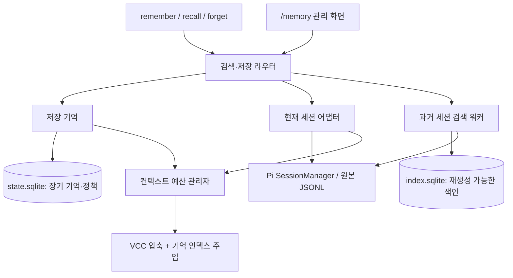

# 통합 메모리 익스텐션 설계안

상태는 설계 제안이다. 새 패키지 구현, 설치, 데이터 이전은 하지 않았다. 가칭은 `@ryan_nookpi/pi-extension-memory`, 소스 위치는 `packages/memory`다. 패키지명은 배포 전에 확정한다.

## 1. 목표와 경계

`memory-layer`, `vcc-ko`, 과거 세션 검색을 하나의 익스텐션으로 만든다. 모델은 하나의 recall 도구로 기억을 찾고, 익스텐션은 출처에 따라 적합한 검색 경로를 선택한다.

통합할 것은 도구, 검색 결과 형식, 컨텍스트 예산, 설정, 진단 화면이다. 다음 데이터의 의미까지 같게 만들지는 않는다.

| 데이터 | 의미 | 보존 원칙 |
| --- | --- | --- |
| 저장된 기억 | 사용자가 저장을 요청한 선호·규칙·결정·메모 | `scope`와 `tier`를 유지. 과거 대화보다 권위 있는 사실로 무조건 취급하지는 않음 |
| 현재 대화 | 현재 세션의 지시·작업·도구 결과와 압축 요약 | 현재 분기, 원래 역할, 원문 참조를 보존 |
| 과거 대화 | 다른 세션에서 있었던 발언과 작업의 근거 | 당시의 기록으로 표시. 현재 지시로 자동 승격하지 않음 |

초기 범위에서 제외한다.

- 자동 장기 기억 생성, 자동 사실 판정·병합, 외부 임베딩 API, 클라우드 동기화.
- 기존 세션 JSONL 재작성, 대화 원문 삭제, 다른 익스텐션 자동 제거.
- 상주 시스템 데몬. 필요하다면 다중 세션 부하 측정 후 도입한다.

## 2. 현재 구현에서 유지할 계약

| 구성요소 | 확인된 현재 동작 | 통합 시 주의점 |
| --- | --- | --- |
| memory-layer | `agent/user/project`, `profile/log/note`, 제목 인덱스를 매 턴 주입 | tier는 출처 신뢰도가 아니라 우선순위다. 현재 주입 예산은 토큰이 아닌 200줄 |
| persistent memory | Markdown + tier sidecar, 파일 잠금과 atomic rename | 여러 파일이 한 번에 커밋되는 DB 트랜잭션과는 다름 |
| agent memory | `ownerSessionId`가 있는 custom entry와 삭제 entry, `getEntries()`로 재구성 | 같은 세션의 모든 분기에서 공유하지만 fork에는 상속하지 않는 현재 계약을 유지 |
| VCC | 알고리즘 압축, 누적 files/commits state, `details.version = 3` | 요약 텍스트만 옮기면 누적 상태와 호환성이 깨질 수 있음 |
| VCC recall | 현재 세션의 lineage/all, 역할 필터, touched, 파일 내용 펼치기 | `#N`과 `#cN`은 세션 전체 파일 순서로 매긴 별도 번호 공간 |
| Pi | 세션은 트리, `context_edit`은 분기별 모델 입력만 변경 | 원문 검색과 다음 모델 요청에 보낼 유효 컨텍스트를 분리해야 함 |

현재 VCC의 `scope: all`은 모든 세션이 아니라 현재 세션의 모든 분기다. 새 API에서 이 의미를 과거 세션 검색으로 바꾸지 않는다.

## 3. 구조



권장 내부 모듈은 `memory-store`, `session-adapter`, `compactor`, `history-index`, `retrieval`, `context-budget`, `migration`이다. 별도 설치 패키지나 범용 플러그인 프레임워크로 만들 필요는 없다. 데이터 출처별 어댑터와 공통 결과 타입이면 충분하다.

과거 색인이 없거나 고장 나도 저장 기억과 현재 세션 검색은 계속 동작해야 한다. compaction은 과거 세션 색인 완료를 기다리지 않는다. Picky의 한 프로세스 안에 여러 세션이 있을 수 있으므로 mutable state는 모듈 전역이 아니라 extension runtime/session 인스턴스에 둔다. 파일을 아직 저장하지 않은 현재 세션도 SessionManager를 통해 조회한다.

## 4. 도구 계약

공개 도구명은 기존 메모리 계열과 맞춘 `memory_remember`, `memory_recall`, `memory_forget`을 권장한다. `session_recall`을 모델에 동시에 노출하지 않는다. 별도 `memory_list`는 recall의 list 연산으로 합친다. 아래는 구현 전 제안 스키마다.

```ts
memory_remember({
  content, title?, scope: "agent" | "user" | "project",
  tier?: "profile" | "log" | "note", topic?, sourceRefs?
})

memory_recall({
  op?: "search", query,
  source?: "auto" | "memory" | "current" | "history",
  project?: "current" | "all" | { id: string },
  branch?: "lineage" | "all",
  memoryScope?: "agent" | "user" | "project", tier?,
  role?, sessionId?, leafId?, cursor?, limit?
})
memory_recall({ op: "read", refs: ["mem:...", "session:..."], project?, branch?, leafId?, cursor?, limit? })
memory_recall({ op: "list", source: "memory" | "history", project?, cursor? })
memory_recall({ op: "touched", sessionId?: "current" | string, branch?, leafId?, cursor? })

memory_forget({ id: "mem:..." })
```

- `auto`는 저장 기억, 현재 대화, 이미 준비된 현재 프로젝트의 과거 색인을 함께 조회한다. LLM으로 검색할 출처를 분류하지 않는다.
- 과거 색인이 비어 있으면 뒤에서 색인을 시작하고 나머지 결과를 먼저 반환한다. 상태는 `partial/indexing`이며, 이를 전체 범위의 검색 결과 없음으로 표현하지 않는다.
- 현재 세션은 기본 `lineage`, 과거 세션은 프로젝트 안의 모든 분기를 포함한 역사 기록이다. 과거 분기의 발언을 현재 진행 상황으로 표현하지 않는다. 과거 세션을 `lineage`로 제한하려면 `sessionId + leafId`를 명시하고 parent 관계를 따라간다. 과거 파일의 마지막 줄이 현재 활성 leaf라고 추측하지 않는다. 현재 lineage 조회가 실패하거나 비어 있어도 전체 분기로 자동 확대하지 않는다.
- `project: current`가 기본이다. 전역 user 기억과 현재 agent 기억은 계속 접근 가능하고, project 기억과 과거 세션은 현재 프로젝트로 제한한다. 다른 프로젝트 탐색은 명시적으로 범위를 넓힌다.
- `memoryScope/tier`를 지정하면 저장 기억 검색으로 한정한다. `source: history`와 같이 모순된 조합은 오류로 돌려준다. 필터를 조용히 무시하지 않는다.
- `op: read`에도 현재 사용자의 프로젝트 접근 범위와 branch 정책을 다시 적용한다. 유효한 ref가 곧 접근 권한은 아니다. 범위를 넓힐 때는 read에도 명시적인 범위 지정이 필요하다.
- `op: search`가 기본이므로 일상 호출은 `memory_recall({ query: "크론 세션 복구" })`면 된다. 관리와 정확한 펼치기만 다른 연산을 쓴다.
- regex 검색은 호환 어댑터의 현재 세션 경로에만 시간·입력 크기 제한을 두고 유지한다. 전체 과거 기록에 임의 regex를 실행하지 않는다.

반환값은 텍스트와 동일한 의미의 `structuredContent`를 제공한다. 기존 도구가 이미 반환하는 텍스트를 분석해 구조화 데이터를 재구성하지 않는다. 기본 결과 수는 10개, 최대 20개를 제안하며 개수 외 출력 토큰 상한도 둔다. cursor는 query/filter hash와 index generation을 포함하고, 세대가 사라진 cursor에는 재검색을 요청한다.

```ts
{
  status: "ready" | "partial" | "unavailable",
  requested: ["memory", "current", "history"],
  searched: ["memory", "current"],
  unavailable: [{ source: "history", reason: "indexing" }],
  indexGeneration, indexedThrough, nextCursor,
  results: [{ ref, source, role, projectId, sessionId, timestamp,
              title, snippet, matchReason, provenance, branchState }]
}
```

결과는 출처별로 묶고, 각 출처 안에서 순위를 매긴다. 저장 기억은 관련 있는 항목만 고른 뒤 기존 `profile > log > note`, 같은 tier 내 관련도 순서를 유지한다. 현재 메모리 검색 점수, VCC 점수, FTS BM25를 그대로 더하지 않는다. 결과 슬롯과 토큰 예산을 출처별로 나누며, 비어 있는 출처의 예산만 다른 출처에 준다. 반환 상한·시간 제한으로 빠진 범위는 결과에 표시한다.

## 5. 저장소와 식별자

### 정본과 캐시를 나눈다

| 저장소 | 역할 | 삭제·재생성 가능 여부 |
| --- | --- | --- |
| `state.sqlite` | user/project 기억, revision, 이전 ID 매핑, 제외 정책, 마이그레이션 기록 | 정본. 색인 복구 명령에서 삭제 금지 |
| Pi custom entry | agent 기억과 tombstone | 세션 정본. owner session 계약 유지 |
| Pi JSONL | 대화·compaction·branch·context edit 원본 | 익스텐션은 읽기만 함. 현재 세션 상태 기록은 Pi API만 사용 |
| `index.sqlite` | 세션 manifest, 메시지 청크, FTS, 색인 checkpoint | 원본과 정책에서 재생성 가능 |
| Markdown export | 기억을 읽거나 백업하는 표현 | 기본적으로 파생 파일. 수정 즉시 동기화하는 양방향 저장소는 아님 |

**권장안은 장기 기억을 SQLite 정본으로 이전하는 것이다.** 동시 저장, revision, tombstone, provenance를 한 트랜잭션으로 다룰 수 있다. 다만 현재 Markdown 직접 편집 방식을 잃는 제품 변경이므로 확정 전에 선택해야 한다. 직접 편집이 필수라면 Markdown 정본을 유지하는 대안이 가능하지만, sidecar까지 묶는 복구 journal과 단일 writer 규칙이 추가로 필요하다. 두 형식을 동시에 정본으로 두는 것은 피한다.

`state.sqlite`와 `index.sqlite` 사이의 원자성을 가정하지 않는다. 기억 변경의 성공 여부는 state 트랜잭션으로 결정하고, 파생 색인 갱신은 revision watermark로 따라간다. 기억 recall은 최신 state를 읽으므로 index 반영 지연이 기억 삭제·수정을 되돌리지 않는다. SQLite WAL의 여러 DB 트랜잭션은 전체가 하나의 원자적 커밋이 아님도 고려해야 한다.[S2]

저장 루트는 사용자 agent 디렉터리 설정을 따르며, 기본 디렉터리와 별도 `PI_CODING_AGENT_DIR` 환경을 섞지 않는다. 디렉터리는 `0700`, DB·백업·export는 `0600`을 기본으로 한다. 로컬 디스크에서만 WAL을 지원하며 네트워크 파일시스템과 실시간 클라우드 동기화 디렉터리는 지원 대상에서 제외한다.

최소 테이블은 state의 `memories`, `memory_revisions`, `legacy_aliases`, `tombstones`, `project_aliases`, `import_runs`와 index의 `source_files`, `sessions`, `entries`, `chunks_fts`, `index_state`다. project/session/time/entry 키에 일반 인덱스를 두고, 프로젝트 검색에서 전체 JSON을 읽은 뒤 경로 `LIKE`로 거르지 않는다. user/project 기억은 state 정본에서 읽고 agent 기억은 현재 세션 custom entry에서 읽는다.

### 장기 기억 ID와 변경 이력

- 새 기억은 내용과 독립적인 UUID를 가진다. 같은 기억을 수정해도 ID는 바뀌지 않고 revision만 올라간다.
- 현재 content 기반 ID는 `legacy_alias`로 보존한다. scope/project/session 경계 안에서만 해석하고 충돌은 거부한다.
- `remember`의 기존 같은 scope/topic/title 갱신 계약을 보존하되, 기존 중복이 모호하면 자동 병합하지 않는다.
- tier는 `profile/log/note`를 유지하고 자동 만료를 도입하지 않는다. 출처, 저장 주체, 저장 시각, 원문 ref는 별도 필드다.

### 대화 참조

새 ref의 논리 키는 `(sourceRootId, sessionId, entryId, part)`다. 모델에는 이를 담은 불투명한 ref를 돌려주며, 임의 로컬 경로를 ref로 받지 않는다.

`#N/#cN`은 기존 요약을 읽기 위한 alias로 남긴다. 현재 세션에서는 예전 호출을 그대로 해석하고, 과거 세션에서는 세션 식별자 없이 bare 번호를 받지 않는다. 필터링·중복 제거·재색인 후에도 번호를 다시 매기지 않는다. 파일 byte offset은 속도 개선용 힌트일 뿐 정본 ID가 아니다.

동일 session ID의 파일이 여러 개면 단순히 mtime이 최신인 것을 정본으로 고르지 않는다. 내용이 같은 복제본과 서로 갈라진 파일을 구분하고, 후자는 conflict 상태로 표시한다. 헤더가 없는 `subagent-*.jsonl`은 별도 포맷 어댑터가 확인되기 전까지 제외 이유와 개수를 보여준다.

프로젝트는 기존 remote/root-commit/path 식별자와의 alias를 보존한다. 새 canonical ID는 URL 정규화와 hash로 충돌을 줄인다. remote 변경, 삭제된 worktree의 옛 cwd, 경로 이동은 명시적 alias로 해결한다. 기존 ID가 충돌한 데이터는 추측해서 분리하지 않는다.

## 6. 압축과 기억 주입

Pi의 `session_before_compact`에서 VCC 알고리즘을 호출하되, 입력은 공식 `preparation`과 유효 session projection을 따른다.[P1][P2]

- `context_edit`으로 모델 입력에서 제외된 실패 응답을 raw history에서 다시 읽어 요약에 되살리지 않는다. 명시적 역사 검색에서는 찾아볼 수 있지만 `omitted/replaced` 상태를 붙인다.
- VCC의 첫 요청 보존, 최근 요청, 누적 파일·커밋, 한국어 규칙, `#N/#cN` provenance, tool call/result 짝 보존을 유지한다.
- 새 `details`에는 별도의 compactor ID와 schema version을 쓰고 `pi-vcc-ko` v3 reader를 둔다. 초기 VCC 요약의 창 상대 `#N`을 최신 전역 번호로 해석하지 않는다. version을 확인할 수 없는 요약은 텍스트로 보존하되 참조 해석 불가를 표시한다. 구조화 state도 지원 schema일 때만 읽는다. 기존 세션을 일괄 재작성하지 않는다.
- 압축 취소·실패는 기존 유효 컨텍스트를 유지한다. 자동 LLM 요약 fallback으로 숨은 API 비용을 만들지 않는다. 범위 축소 재시도와 명시적 오류 처리 정책을 둔다.
- 현재 Pi는 자동 압축 후 재개를 처리한다. 오래된 VCC의 자체 auto-continue를 새 기본 동작으로 가져오지 않는다.

예산은 하나의 관리자가 계산하지만 실제 적용 훅은 다르다. 기억 인덱스는 `before_agent_start`, 요약은 compaction 훅, 도구 출력은 recall 결과 상한으로 제어한다. 매 턴 저장된 compaction을 다시 쓰지는 않는다.

기억 인덱스는 토큰 예산과 안정된 정렬을 사용하고, 데이터 revision이 바뀔 때만 갱신한다. 제목의 개행·제어 문자를 정규화하고 개별 제목 길이를 제한한다. 매 턴 질의에 맞춰 전체 system prompt를 재배열하는 방식은 prefix cache를 흔들 수 있어 피한다. Pi의 구조화된 `systemPromptOptions` 변경 경로를 우선 검토하고, 다른 익스텐션이 forced system prompt를 사용하는 경우의 합성도 테스트한다.[P1]

중복 제거는 provenance가 같은 파생 출력에 우선 적용한다. 내용이 비슷하다는 이유만으로 사용자의 최근 지시를 제거하지 않는다. recall 출력, 기억 인덱스, 자체 요약의 반복 인용은 재색인·재요약에서 제외해 자기 출력이 검색 상위를 차지하지 않게 한다.

## 7. 과거 세션 색인

### 먼저 확인한 성능

현재 환경의 `pi-session-search@1.6.0`, Node 24.18.1, FTS5-only 측정이다. 새 설계의 성능 보장이 아니다.

| 항목 | 결과 |
| --- | ---: |
| 원본 JSONL | 18,952개 / 12.6GiB |
| 실제 색인 | 16,823 세션 |
| 최초 색인 | 68.39초 |
| 증분 동기화 | 2.40~4.55초 |
| 검색 60회 중앙값 / p95 | 3.19 / 10.86ms |
| 인덱스 | 약 780MiB |
| 최초 색인 최대 프로세스 RSS | 1.48GiB |
| 별도 프로세스 재기동 후 검색 / 증분 완료 RSS | 75 / 157MiB |

최초 색인 직후 높은 RSS가 남았으며, 재기동 후 수치가 자동 메모리 반환을 증명하지는 않는다. live corpus, OS 캐시 유지, 워커 RPC 경로 측정이다. Pi 전체 UI, 한국어 검색 정확도, 여러 프로세스 동시 색인은 검증하지 않았다. 원시 벤치마크 자료는 로컬 `/tmp/pi-session-search-bench.9qUI2X/`에 있으며 세션 내용이 든 DB는 저장소에 추가하지 않는다.

### 구현 방향

1. **스트리밍 파서**. 파일 전체를 문자열과 객체 배열로 두 번 적재하지 않는다. 완성된 JSONL 행만 커밋하고 마지막 불완전 행은 다음 읽기로 넘긴다. 큰 이미지·thinking·도구 출력은 검색 문서에 복제하지 않는다. 단일 행 자체가 매우 큰 경우의 byte 상한과 제외 상태도 필요하다. 세션 포맷 v1/v2/v3 변환은 읽기 전용 어댑터 안에서 한다. 과거 파일을 `SessionManager.open()`으로 일괄 열어 업스트림의 디스크 마이그레이션을 유발하지 않는다.
2. **메시지 청크 단위 색인**. 이름·사용자 메시지·assistant 최종 텍스트·custom 완료 결과·요약을 역할별로 분리한다. 큰 tool output은 1차 색인에서 제외하고 session 후보를 찾은 뒤 원문에서 좁혀 검색한다. tool-only 문자열은 기본 검색으로 찾지 못한다는 한계를 명시한다. current-session recall의 기존 범위는 줄이지 않는다.
3. **증분 manifest**. file identity, size, mtime, prefix/tail hash, 완료 byte offset을 기록한다. append가 확인되면 이어 읽고, truncate/replace/같은 크기 수정은 해당 파일을 재색인한다. 크기가 같다는 이유만으로 변경 없음을 판단하지 않는다.
4. **짧은 트랜잭션과 재개점**. parser version과 checkpoint를 청크 결과와 같은 트랜잭션에 기록한다. 중단 후에는 마지막 완료 청크부터 재개한다. 재빌드는 같은 index DB에 새 generation으로 만들고 active generation 포인터를 트랜잭션으로 전환한다. 이전 reader/cursor의 유효기간 후 옛 세대를 회수한다. 두 세대가 공존할 디스크 여유, 장기 읽기, WAL 증가를 제한한다.
5. **한 번에 한 색인 writer**. Pi 프로세스마다 독립 전체 스캔을 시작하지 않는다. 동일 index DB 안의 lease와 fencing generation을 짧은 write 트랜잭션마다 확인해 오래된 writer의 커밋을 막는다. TTL만 믿고 살아 있는 writer를 덮어쓰지 않는다. 작은 memory write는 별도 state DB에서 처리한다.
6. **작업 수명 제한**. 첫 history 조회 또는 사용자의 rebuild로 워커를 시작한다. session_start는 등록·경량 상태 확인만 하고 전체 스캔을 기다리지 않는다. shutdown/reload에서는 타이머와 워커를 종료하며 다음 프로세스가 이어받는다.[P1]
7. **느린 복구 스캔**. 변경 이벤트는 같은 프로세스의 최신 세션을 알리는 힌트로 쓰고, 놓친 변경은 낮은 빈도의 manifest 대조로 복구한다. 작업 완료 감시는 `agent_end`가 아니라 최종 `agent_settled`도 고려한다. 이벤트가 모든 외부 프로세스 파일 변경을 보장한다고 가정하지 않는다.

`node:sqlite`의 DatabaseSync 호출은 동기식이므로 모든 큰 SQL·스캔은 워커에서 수행한다.[S3] WAL은 여러 reader를 허용하지만 writer는 하나다. 여러 Pi 인스턴스를 위한 색인 writer 조정이 여전히 필요하다.[S2]

Picky의 메인 세션도 non-TTY일 수 있다. `!stdin.isTTY`를 subagent 판별 기준으로 쓰지 않는다. 명시적 host capability/child marker 또는 설정을 사용하고, worker 선출은 TTY 여부와 무관하게 동작시킨다. 원본 세션 경로도 고정 `~/.pi/agent/sessions`가 아니라 현재 SessionManager, 설정된 roots, 명시한 archive에서 해석한다.

## 8. 한국어 검색과 랭킹

기존 `porter unicode61`을 그대로 쓰는 것은 권장하지 않는다. 한국어 조사·어미를 분리하지 못하고, English Porter stemming도 이를 해결하지 않는다.[S1]

인메모리 SQLite에 `배포를 진행했다`, `메모리에 저장했다`, `서브에이전트를 병렬로 실행했다`를 넣어 확인했다.

| 질의 | unicode61 exact | unicode61 prefix | trigram exact |
| --- | --- | --- | --- |
| 배포 | 불일치 | 일치 | 불일치(2글자) |
| 메모리 | 불일치 | 이번 실험 미측정 | 일치 |
| 서브에이전트 | 불일치 | 이번 실험 미측정 | 일치 |

권장 시작점은 Unicode 정규화, VCC의 한국어 query noise 제거, exact/phrase 우선, 제한된 prefix 후보 확장이다. `배포해줘`와 `배포를`처럼 양쪽 표현이 달라지는 경우까지 해결한다고 주장하지 않는다.

trigram은 3글자 미만 질의를 해결하지 못하고 색인 크기도 커질 수 있으므로 기본 전체 색인에 즉시 추가하지 않는다. 대표 질의 30~50개로 Recall@10, MRR, 짧은 단어, 한영 혼합 파일명, 조사·어미 변형을 비교한 뒤 trigram·형태소 분석·로컬 임베딩 중 필요한 수단을 선택한다. 외부 임베딩은 별도 opt-in이며 원문 전송 범위와 비용을 먼저 보여준다.

VCC 원문 refs가 있는 청크에는 exact entry lookup을 제공하고, 세션 전체 BM25 하나로 관련 메시지 위치를 대신하지 않는다. 동일 텍스트가 fork·요약·서브에이전트 결과에 복제되면 결과를 접되 출처 목록은 유지한다. 메시지별 색인과 assistant/custom 내용 추가는 기존 세션별 FTS보다 행 수·용량을 늘린다. 780MiB와 검색 p95 10.86ms를 새 설계에 그대로 적용할 수 없으므로, 전체 구현 전에 동일 corpus의 청크 색인 프로토타입을 측정한다.

## 9. 보안, 잊기, 장애 의미

- 검색 결과는 출처가 있는 자료다. 과거 tool output·웹 문서의 명령을 현재 system instruction으로 삽입하지 않는다. 저장 기억도 현재 사용자 지시나 시스템 규칙을 덮어쓰지 않는다.
- tool 결과·custom 내용의 세션 검색 범위를 넓히면 비밀정보 노출 면적도 넓어진다. system prompt, thinking, 이미지, 인증 정보 패턴은 기본 색인에서 제외·마스킹한다. 패턴 검사는 완전한 유출 방지가 아니며 현재 프로세스는 OS 권한을 그대로 가진다.
- 원문 펼치기도 scope·제외 정책·마스킹을 다시 거친다. 특히 `bashExecution.excludeFromContext=true`는 모델용 recall/expand/색인에서 제외한다. 이는 VCC의 현재 recall보다 엄격한 의도적 보안 변경이며, 일반적인 실패 응답의 `context_edit` 생략과 구분한다. 임의 경로와 symlink를 통한 허용 root 이탈을 거부한다. API key를 worker 옵션에 전달할 이유가 없다.
- `forget`은 저장 기억의 활성 조회와 주입을 중단한다. 과거 대화에서 같은 문장이 사라지거나 디스크에서 복구 불가능해진다는 뜻은 아니다.
- 재색인·이전 재실행으로 삭제 기억을 되살리지 않도록 state에 tombstone/이전 manifest를 유지한다. 알려진 sourceRef에서의 자동 재승격도 막는다. 의미가 같은 모든 과거 발언을 자동으로 찾아 삭제한다고 약속하지 않는다.
- 세션 제외·색인 purge는 `/memory exclude` 같은 별도 관리 기능으로 둔다. 원본 세션 삭제와 백업·WAL까지 포함한 완전 삭제는 별도 승인과 정책이 필요하다.
- 색인 실패는 `unavailable`, 진행 중은 `partial`, 정상 검색 무결과는 `ready + []`로 구분한다. 파일이 사라졌으면 캐시 본문을 원문인 것처럼 반환하지 않는다.
- 취소된 조회·session 전환 후 늦게 도착한 worker 결과는 session generation으로 폐기한다. timeout은 검색 결과 없음이 아니다. debug 로그는 기본적으로 ID·크기·소요 시간만 기록한다. 프롬프트·기억·원문 미리보기 덤프는 별도 opt-in과 파일 권한·보관기한을 둔다.

## 10. 이전과 공존

1. **진단**. 기존 memory/VCC 설치, 데이터 위치, agent 디렉터리, schema, 중복 ID, 타이틀 충돌을 읽기 전용으로 조사한다.
2. **복사 이전**. user/project Markdown과 tier sidecar를 읽어 새 DB로 가져온다. 원본은 변경하지 않는다. 기억 수·scope·tier·내용 hash·legacy ID 대응표를 검사한다.
3. **세션 상태 호환**. agent custom entry와 delete entry는 세션에서 읽고 VCC v3 details를 해석한다. 기존 세션을 일괄 변환하지 않는다.
4. **비교 실행**. 새 저장·주입·압축 훅을 활성화하기 전에 기존 기억 조회와 현재 세션 recall 결과를 비교한다. 과거 색인은 별도 생성한다.
5. **명시적 전환**. 기존 `memory-layer`와 `vcc-ko`를 비활성화하고 새 익스텐션만 압축·주입·도구를 담당한다. 로드 순서에 기대어 둘 다 활성화하지 않는다. 전환 전 기존 프로세스도 종료 또는 reload해야 한다.
6. **롤백 경계**. 새 DB에 쓰기 전에는 원래 확장으로 바로 복귀 가능하다. 전환 후 새 쓰기가 있으면 원본은 낡았으므로 export/reconciliation이 필요하다. 자동 양방향 동기화는 하지 않는다.

호환 어댑터는 기존 `memory_recall({ id, scope, tier })`, `memory_list`, `session_recall`, 과거 `vcc_recall` 형태를 새 내부 API로 변환할 수 있다. 기본 모델 노출에는 포함하지 않고, 명시적 compatibility 모드에서만 등록한다. 저장된 요약의 구도구명 안내는 읽을 때 변환하며 raw JSONL은 바꾸지 않는다.

확장 충돌 탐지는 알려진 도구·설정·compactor 흔적으로 경고하고, 확실하지 않으면 주입·압축을 활성화하지 않는 방향을 권장한다. Pi가 다른 확장을 자동 제거해 주는 API를 제공한다고 가정하지 않는다. 프로젝트 alias와 새 ID migration은 충돌이 없는 범위만 자동으로 처리한다.

## 11. 구현 순서와 통과 기준

| 단계 | 산출물 | 완료 조건 |
| --- | --- | --- |
| 1. 현재 동작 통합 | 장기 기억 + VCC + 통합 recall, history 비활성 | 기존 scope/tier/fork/delete, 한국어 압축, #N/#cN, lineage/touched 테스트 유지. 저장·압축 실패 시 원본 보존 |
| 2. 과거 세션 검색 | 스트리밍 색인, partial 결과, 관리 상태 | fixture와 실제 로컬 corpus의 포함/제외 수 설명, 원문 ref 검증, 색인 중 검색 가능 |
| 3. 동시성과 복구 | writer 선출, 재개점, migration rollback 절차 | 두 Pi 프로세스 동시 저장, 10개 reader, writer 중단·인계·reload, 반쯤 쓴 JSONL, 같은 크기 수정 테스트 |
| 4. 검색 품질 | 한국어 정답셋, 랭킹 비교 | 정확도와 지연·용량을 함께 보고 tokenizer 선택. 의미 검색은 필요가 입증될 때 추가 |

설계 목표는 저장 인덱스 준비 p95 300ms 이내, warm recall p95 100ms 이내, 초기 색인 RSS 512MiB 이내다. 아직 달성한 수치가 아니며 기존 벤치마크와 같은 corpus·Node·캐시 조건으로 다시 측정한다. 현재 1.48GiB 초기 RSS를 줄이려면 streaming뿐 아니라 청크·단일 행·SQL 결과 크기의 상한이 필요하다.

성능 테스트 외에 다음 반례를 반드시 넣는다.

- 압축 뒤 여러 번 recall해도 자신의 검색 출력이 상위 결과가 되지 않는다.
- branch를 바꾸면 대화 지시의 적용 범위는 달라지지만, session-wide agent 기억은 현재 계약대로 유지된다. fork에는 전달되지 않는다.
- 다른 프로젝트의 ref를 알아도 기본 범위로 읽지 못한다. 다른 session의 agent 기억이 history 검색을 통해 노출되지 않는다.
- omitted/replaced 원문을 검색할 수 있어도 압축에 자동 복귀하지 않는다.
- 잊은 기억이 rebuild·재이전·옛 legacy ID로 다시 활성화되지 않는다.
- tool-call/result pairing, 중첩 도구 파일 변경 메타데이터, custom subagent 완료 메시지의 provenance가 유지된다.
- Picky non-TTY 메인 세션에서도 검색·색인이 동작하며, worker가 종료된 세션에 결과를 주입하지 않는다.
- legacy summary version이 불명확하거나 entry ID가 중복되면 틀린 원문을 추측해서 반환하지 않는다. excludeFromContext bash는 ref를 알아도 모델용 expand에서 노출되지 않는다.

## 12. 확정해야 할 선택

| 선택 | 권장안 | 이유·대가 |
| --- | --- | --- |
| 기억 정본 | SQLite + Markdown export | revision·동시성·삭제 의미가 단순해짐. Markdown 직접 편집 방식은 달라짐 |
| 과거 검색 기본 범위 | 현재 프로젝트, 이미 준비된 색인만 즉시 사용 | 다른 프로젝트 자료의 불필요한 혼입과 최초 조회 대기 방지 |
| agent 기억 | 현재 session-wide/fork 비상속 유지 | branch-sensitive로 바꾸는 것은 별도 제품 변경 |
| 기억 자동 생성 | 초기에는 하지 않음 | 요약의 오해가 지속 규칙으로 굳는 것을 방지 |
| 검색 정밀도 | 로컬 lexical 먼저, 한국어 정답셋으로 개선 | 빠르고 외부 전송 없음. 의미·동의어 검색은 제한됨 |
| 백그라운드 실행 | 필요 시 워커 + 공유 writer lease | 상주 데몬 없이 시작 가능. 모든 Pi 종료 시 색인은 멈추고 다음 실행에서 재개 |
| 지원 런타임 | 우선 Pi 1.1.x와 Picky 실제 호스트를 대상으로 검증 | 설치 SDK와 Picky 번들 SDK가 다를 수 있음. API probe 후 지원 하한을 확정 |

구현 전에 사용자 판단이 가장 필요한 것은 Markdown 직접 편집을 유지할지다. 나머지는 위 기본안으로 시작하고 실제 검색 품질·동시성 측정으로 좁힐 수 있다.

## 근거

### 로컬 구현

- [memory 타입](../packages/memory-layer/types.ts), [영구 저장](../packages/memory-layer/storage.ts), [agent 기억](../packages/memory-layer/agent-store.ts), [주입](../packages/memory-layer/inject.ts), [프로젝트 ID](../packages/memory-layer/project-id.ts)
- [VCC 압축 훅](../packages/vcc-ko/src/hooks/before-compact.ts), [누적 요약](../packages/vcc-ko/src/core/summarize.ts), [전역 refs](../packages/vcc-ko/src/core/global-indices.ts), [원문 로더](../packages/vcc-ko/src/core/load-messages.ts), [recall](../packages/vcc-ko/src/tools/recall.ts)
- `pi-session-search@1.6.0` 배포 소스 `src/fts-index.ts`, `parser.ts`, `index-service.ts`와 이 세션의 로컬 벤치마크. 라이선스는 MIT이며 코드를 가져오면 저작권 고지를 유지한다. VCC의 기존 MIT 고지도 유지한다.

### 공식 문서

- [P1] [Pi Extensions](https://github.com/earendil-works/pi/blob/v1.1.0/packages/coding-agent/docs/extensions.md), 특히 lifecycle, structured prompt, state, mode, structuredContent. 설치된 1.1.0 문서와 타입을 함께 확인했다.
- [P2] [Pi Compaction](https://github.com/earendil-works/pi/blob/v1.1.0/packages/coding-agent/docs/compaction.md), preparation, firstKeptEntryId, recovery ordering.
- [P3] [Pi Session Format](https://github.com/earendil-works/pi/blob/v1.1.0/packages/coding-agent/docs/session-format.md), entry IDs, branch, context_edit, custom/custom_message.
- [S1] [SQLite FTS5](https://www.sqlite.org/fts5.html#tokenizers), unicode61/porter/trigram과 3문자 미만 제한.
- [S2] [SQLite WAL](https://www.sqlite.org/wal.html), 단일 writer, 같은 host, checkpoint, 다중 DB 원자성 제한.
- [S3] [Node SQLite](https://nodejs.org/docs/latest-v24.x/api/sqlite.html#class-databasesync), DatabaseSync의 동기 실행. 최소 지원 런타임에서는 FTS5 기능 probe가 별도로 필요하다.
